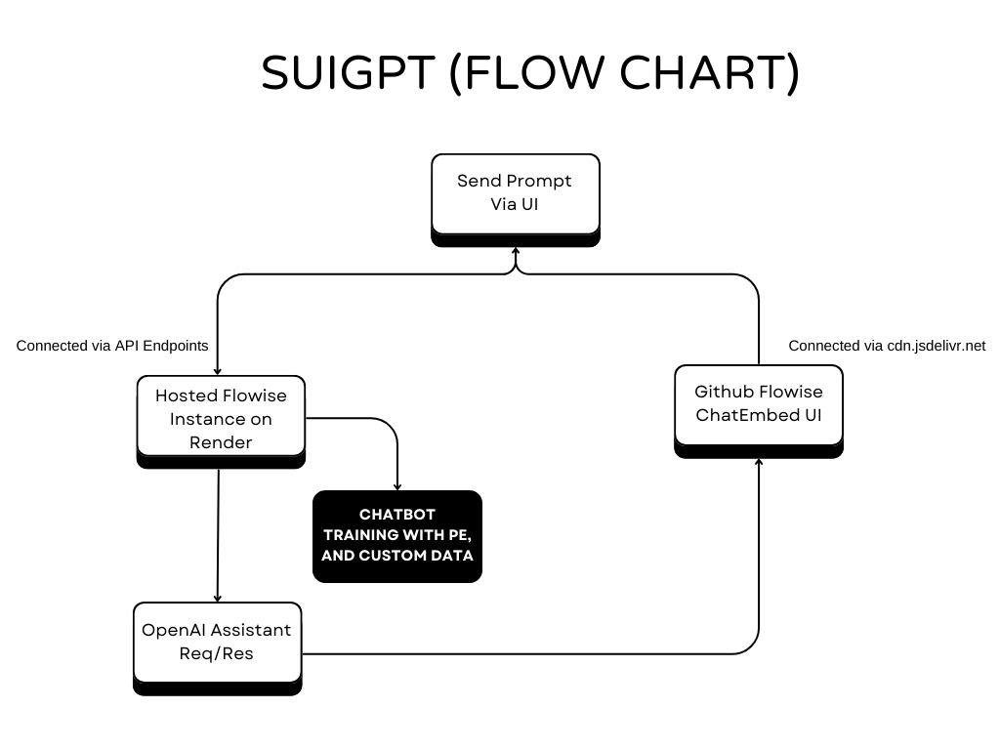

# Sui Assistant - Smart AI Assistant for Web3 Developers to build on Sui 🤖

**(➡️ This project is a submission to the Sui Overflow Hackathon 👨‍💻)**

 

 <strong> ✨ Sui Assistant 🔥 </strong> 

 

## Project Overview

***Sui Assistant*** is a highly trained assistant that provides in-depth insights about the Sui Blockchain and its ecosystem projects. It answers queries with precision, making complex Sui topics accessible to **newcomers, researchers, enthusiasts, and developers.**  

Sui Assistant assists developers in building dapps on the Sui Blockchain using the Move Programming Language for smart contract development through a conversational UI, powered by **OpenAI Assistants and the GPT-4o model.**  

It helps developers code, fix, and test their smart contracts written in Move to build web3 applications on Sui. Simply enter a prompt in the UI to get accurate answers. Specially designed for the Sui community of developers and ecosystem projects, Sui Assistant was developed by Asharib Ali as a submission for the **"Sui Overflow Hackathon"**  

**Sui Assistant** offers many great features to help developers build and ship quickly on **Sui Blockchain.**  

## Problem Statement with Solution

Developers want to build on Sui but lack an interactive way to quickly and easily create full-stack web3 applications. They might use ChatGPT, but it's trained on outdated data and doesn't know about the latest developments. Plus, GPT Plus costs $20 per month. That's why we need a platform/chatbot to address this issue: "Help developers write, fix, and test their smart contracts in Move for the Sui Blockchain" in a conversational way. I have trained it on a massive amount of Sui Codebase & Ecosystem projects data for building on Sui and have prompt-engineered it to achieve the best results.

## Tech Stack

- **OpenAI Assistant APIs**: Powers the natural language processing abilities to deliver accurate responses and maintain a conversational style with (function calling, code interpreter, and file search).
- **FlowiseAI**: Enables visual programming to streamline the development of conversational AI workflows.
- **Next.js, TypeScript, TailwindCSS**: Provides a seamless, dynamic user interface with a consistent design.
- **OpenAI GPT-4o and Moderation APIs**: Handles advanced chatbot responses and content moderation.
- **Google Custom Search API**: Allows the chatbot to fetch relevant information online to provide up-to-date answers.
- **Custom Training Data with Prompt Engineering**: Ensures precise responses through well-crafted prompts and curated data.
- **OpenAI Whisper API for Speech-to-Text**: Supports speech recognition to deliver a multi-modal experience.
- **LangSmith API for Chatbot Analysis**: Analyzes chatbot interactions for optimization and refinement.

## Potential Integration

I have build two version of the Sui Assistant, both have the same functionalites but one chatbot fix in the full viewport of the screen and another one is the pop-up version, both have same functionality and build with same APIs, these chatbot's can-be integrated into anywhere either on the complete subdomain of official website or the docs website but with the popup version, but I don't know what the team thinks about it.

- **[Sui Assistant Full Version CodeBase](./sui-assistant/)**
- **[Sui Assistant Popup Version CodeBase](./sui-assistant-popup/)**

### Live Hosted web app of Sui Assistant

➡️ [Full Version Web App](https://sui-assistant.vercel.app/)  
➡️ [Popup Version Web App](https://sui-assistant-popup.vercel.app/)  

➡️ **[Prompt used for Assistant Training](./prompt-engineering/prompt.md)**  
➡️ **[Sui Move Code Data examples for Training](./data/sui-codebase/)**  

## Future Improvements

**Expanded Knowledge Base:** Improve the ***Sui Assistant*** by incorporating additional Sui Blockchain resources and Move programming language data to provide more comprehensive and technical answers. 

**Enhance Community Analytics:** Access real-time community sentiment about the Sui Blockchain and its ecosystem projects through metrics from X and other social platforms for multiple use cases, such as in-depth technical, fundamental, and on-chain analysis of the $SUI Coin and its extensive ecosystem tokens.  

**OnChain AI Swap:** Effortlessly swap your Sui Coins and ecosystem tokens directly using a simple and intuitive prompt.