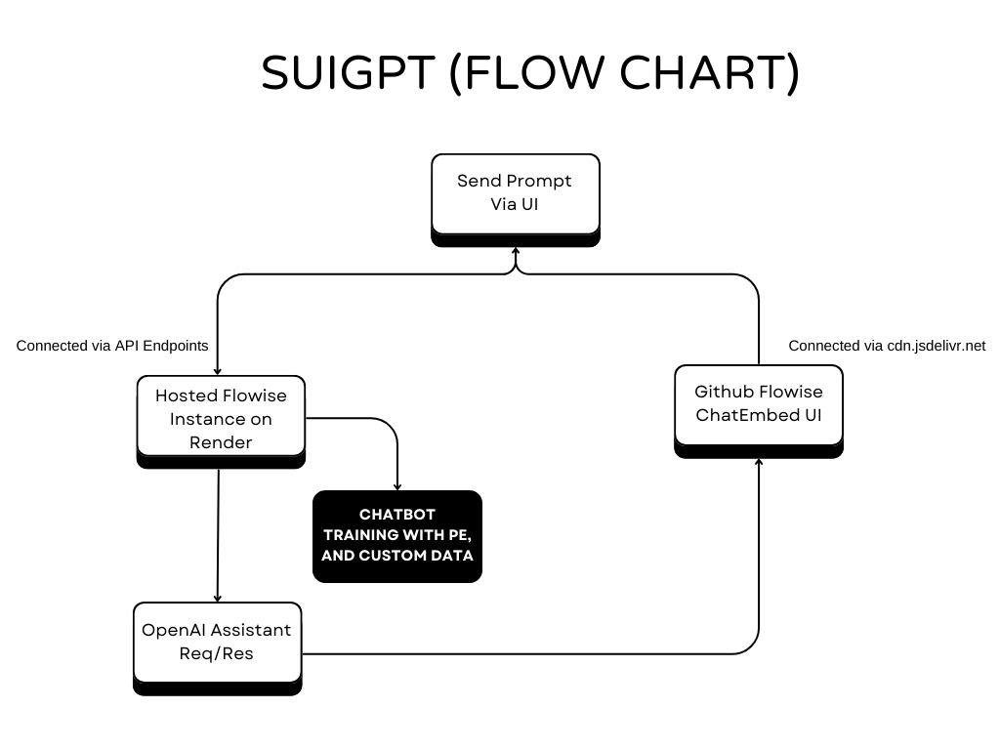

# SuiGPT - Smart AI Assistant for Web3 Developers to build on Sui 🤖

**(➡️ This project is a submission to the Sui Overflow Hackathon 👨‍💻)**

 

✨ SuiGPT 🔥

 

## Project Overview

**SuiGPT** is a highly trained assistant that provides in-depth insights about the Sui Blockchain and its ecosystem projects. It answers queries with precision, making complex Sui topics accessible to **newcomers, researchers, enthusiasts, and developers.**  

SuiGPT assists developers in building dapps on the Sui Blockchain using the Move Programming Language for smart contract development through a conversational UI, powered by **OpenAI Assistants and the GPT-4o model.**  

It helps developers code, fix, and test their smart contracts written in Move to build web3 applications on Sui. Simply enter a prompt in the UI to get accurate answers. Specially designed for the Sui community of developers and ecosystem projects, SuiGPT was developed by Asharib Ali as a submission for the **"Sui Overflow Hackathon"**  

**SuiGPT** offers many great features to help developers build and ship quickly on **Sui Blockchain.**  

## Problem Statement with Solution

Developers want to build on Sui but lack an interactive way to quickly and easily create full-stack web3 applications. They might use ChatGPT, but it's trained on outdated data and doesn't know about the latest developments. Plus, GPT Plus costs $20 per month. That's why we need a platform/chatbot to address this issue: "Help developers write, fix, and test their smart contracts in Move for the Sui Blockchain" in a conversational way. I have trained it on a massive amount of Sui Codebase & Ecosystem projects data for building on Sui and have prompt-engineered it to achieve the best results.

## Tech Stack

- **OpenAI Assistant APIs**: Powers the natural language processing abilities to deliver accurate responses and maintain a conversational style with (function calling, code interpreter, and file search).
- **FlowiseAI**: Enables visual programming to streamline the development of conversational AI workflows.
- **Next.js, TypeScript, TailwindCSS**: Provides a seamless, dynamic user interface with a consistent design.
- **OpenAI GPT-4o and Moderation APIs**: Handles advanced chatbot responses and content moderation.
- **Google Custom Search API**: Allows the chatbot to fetch relevant information online to provide up-to-date answers.
- **Custom Training Data with Prompt Engineering**: Ensures precise responses through well-crafted prompts and curated data.
- **OpenAI Whisper API for Speech-to-Text**: Supports speech recognition to deliver a multi-modal experience.
- **LangSmith API for Chatbot Analysis**: Analyzes chatbot interactions for optimization and refinement.

➡️ **[Deployed on Vercel, Live Demo](https://suigpt.vercel.app/)**  
➡️ **[SuiGPT Full CodeBase](https://github.com/AsharibAli/SuiGPT)**  
➡️ **[Prompt used for Assistant Training](./data/prompt-engineering/prompt-engineering.md)**  
➡️ **[Sui Move Code Data examples for Training](./data/sui-codebase/)**  

## Future Improvements

**Expanded Knowledge Base:** Improve the ChatBot with additional Sui or Move resources for more comprehensive technical/coding answers.